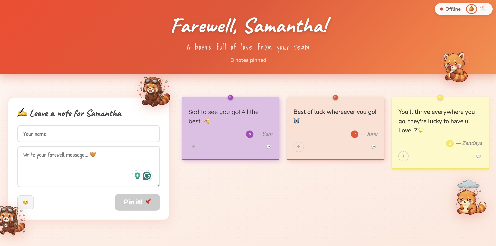
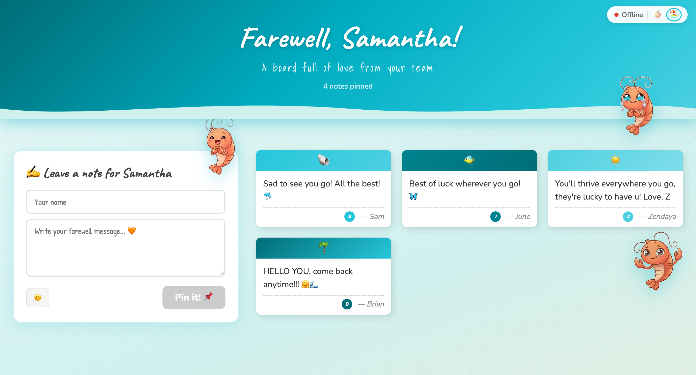

<div align="center">

# Farewell Card

**A collaborative farewell card your whole team can sign together.**
Pin sticky-note goodbyes on a shared board, synced live for everyone — and deploy it on free hosting in minutes.

<p>
  <a href="https://farewell-card.jiayilee.workers.dev/"></a>
  
  
  <a href="LICENSE"></a>
</p>

### [Try the live demo →](https://farewell-card.jiayilee.workers.dev/)

</div>

> [!TIP]
> See a real, deployed card before you build your own. It's the fastest way to understand what you're about to make.

> [!NOTE]
> **Enjoying this?** A star on the repo takes one second, costs nothing, and help others find the project.

<div align="center">

**Original theme**



**Beach theme**



<sub>Flip between the two built-in themes anytime with the toggle in the corner.</sub>

</div>

---

## Before you begin — what you'll need

You don't need to be a developer to build this card. You **do** need three free accounts. Each plays one job, all sign up in your browser, and none ask for a credit card. Think of it as a three-ticket sprint with no story points and a guaranteed ship date.

> [!IMPORTANT]
> Set up these three first. Do it now, and the rest of the guide takes about five minutes. Skip it, and you'll be stuck halfway through wondering where your notes went.

1. **A GitHub account** — your starting point. It holds your copy of the card and is where you make edits. Just arrived from a shared link? Then step one is literally creating a free account here. → [github.com](https://github.com/signup)
2. **A JSONBin account** — your database. Every note your team writes has to live somewhere; this is that somewhere. The free tier is plenty. → [jsonbin.io](https://jsonbin.io)
3. **A Cloudflare account** — your web host. Writing the card isn't enough — it needs a home on the internet so people can open it. It's free, fast worldwide, and stays reachable for colleagues in mainland China. → [cloudflare.com](https://dash.cloudflare.com/sign-up)

> [!TIP]
> Curious *why* Cloudflare specifically? The full reasoning lives in [Hosting: why Cloudflare](#hosting-why-cloudflare). Short version: it works where many hosts quietly don't.

Got all three? Then you're ready. Onward.

---

## Why you'll love this

This isn't just a card. It's a complete, deployable full-stack app you own end-to-end:

1. **A polished frontend.** Vanilla HTML, CSS, and JS. Theming, handwriting fonts, emoji reactions, replies, confetti, and milestone toasts. No build framework to learn.
2. **A real backend.** An edge function proxies storage, caches reads, and keeps your API keys server-side — never in the browser.
3. **Free hosting.** HTTPS and hardened security headers, out of the box.

Two ways to use it:

1. **Say a proper goodbye** your whole team can sign in seconds.
2. **Learn full-stack by shipping something real.** Roughly 600 lines of approachable code that show how *frontend → API → storage → deploy* actually fit together. A great first deployed project, minus the boilerplate and the tears.

> [!NOTE]
> You can build and deploy the whole thing from your browser. No terminal, no tickets, no "let me loop in eng" — just you and a few buttons.

---

## Make your own card

> [!TIP]
> Never touched a terminal? Good news: you never have to. Every numbered step below happens in your browser. The command-line shortcuts hide inside the *"Prefer the command line?"* boxes — open them only if that's your thing.

<details>
<summary><strong>Publishing this as a template for your team?</strong> (one-time maintainer setup)</summary>

<br>

If you're the person sharing this repo so colleagues can make their own cards:

1. **Create a public repo** on GitHub: **New repository** → name it (e.g. `farewell-card`) → **Public** → **Create**. Then add this project to it.
2. **Turn on the template flag** so everyone gets a green **"Use this template"** button: open **Settings** and tick **"Template repository"**.
3. *(Optional)* Add a **description** and **topics** (`farewell`, `template`, `cloudflare-workers`) so it's easy to find.

That's it. Colleagues now follow the numbered steps below.

<details>
<summary>Prefer the command line?</summary>

```bash
gh repo edit <owner>/farewell-card --template
```
</details>

</details>

### Step 1 — Get your own copy

1. Click the green **"Use this template" → "Create a new repository"** button at the top of this repo.
2. Give it a name.
3. Click **Create**. You now have your own independent copy with a clean history.

> [!NOTE]
> Only *fork* the repo if you plan to improve the template itself and send a pull request back here. For making your own card, "Use this template" is the one you want.

<details>
<summary>Prefer the command line?</summary>

```bash
git clone https://github.com/jxxyx-bloop/farewell-card.git
```
</details>

### Step 2 — Personalize

`config.js` is the only file you edit for basic use. One file, no merge conflicts, no design review — a PM's dream. In your new repo:

1. Open `config.js`.
2. Click the pencil (edit) icon.
3. Change the values to suit your recipient.
4. Click **Commit changes**.

```js
window.CARD_CONFIG = {
  recipientName: "Alex",                          // who it's for
  subtitle: "A board full of love from your team",
  composePrompt: "Leave a note for",              // → "Leave a note for Alex"
};
```

### Step 3 — Set up your storage

Your notes live in [JSONBin.io](https://jsonbin.io). All in the browser, all on the free tier:

1. **Sign up** at jsonbin.io.
2. **Create a Bin** and set its content to exactly `{"notes":[]}`, then **Save**.
3. Copy the **Bin ID** (it's in the bin's URL and header).
4. Open **Account → API Keys** and copy your **X-Access-Key**.

> [!IMPORTANT]
> Keep the Bin ID and the X-Access-Key somewhere handy. You'll paste both in the next step, and hunting for them later is nobody's idea of fun.

### Step 4 — Publish it

Deploy to Cloudflare and you get a public link to share:

1. Go to [dash.cloudflare.com](https://dash.cloudflare.com) and choose **Workers & Pages → Create → Workers**.
2. Choose **Connect to Git** and pick your repo.
3. Once it deploys, open the worker's **Settings → Variables and Secrets** and add two **encrypted secrets**:
   1. `JSONBIN_BIN_ID` — your Bin ID from Step 3.
   2. `JSONBIN_API_KEY` — your X-Access-Key from Step 3.
4. Redeploy.

> [!CAUTION]
> Add those two as **encrypted secrets**, not plain variables. They're keys to your data — treat them like your house keys, not a doormat.

<details>
<summary>Prefer the command line? (Wrangler)</summary>

```bash
npm install -g wrangler
wrangler login
wrangler secret put JSONBIN_BIN_ID     # paste your Bin ID
wrangler secret put JSONBIN_API_KEY    # paste your X-Access-Key
node build.js && wrangler deploy
```
</details>

### Step 5 — Share

1. Copy your public link.
2. Send it to your team.
3. Watch the notes roll in.

> [!NOTE]
> No launch checklist, no go-to-market deck, no rollout phases. Just paste the link in the group chat and call it shipped.

---

## Run it locally

This is for developers who want to preview changes on their own machine. Completely optional — you can do everything from your browser without it.

<details>
<summary>Show local development steps</summary>

```bash
cp config.example.js .dev.vars      # create your local secrets file (git-ignored)
# edit .dev.vars and fill in JSONBIN_BIN_ID and JSONBIN_API_KEY
node build.js && wrangler dev       # → http://localhost:8787
```

Open `index.html` directly as a `file://` URL and you'll see **mock data** (there's no backend in that context). Handy for checking the look without any setup.

</details>

---

## Hosting: why Cloudflare

Cloudflare Workers is the recommended host, and the pick is deliberate:

1. **Reachable for China-based colleagues.** Cloudflare's edge usually serves mainland-China visitors via its Hong Kong point of presence, so the card tends to stay reachable for teammates there — where many Western-hosted sites simply aren't. For a cross-region team, this alone seals it.
2. **Your keys stay server-side.** The Worker holds your JSONBin credentials as encrypted secrets. They never reach the browser, never touch git.
3. **Edge caching.** Reads are cached for 30 seconds at the edge, so a stampede of simultaneous signers costs roughly *one* JSONBin API call.
4. **Free tier with HTTPS** and hardened security headers, built in.

<details>
<summary><strong>Prefer Vercel? It works too.</strong></summary>

<br>

Host on Vercel by swapping the Cloudflare Worker for a Vercel **Serverless Function**:

1. **Add `api/notes.js`** — a Vercel function mirroring [`src/worker.js`](src/worker.js): handle `GET`/`PUT` on `/api/notes`, proxy to JSONBin with the `X-Access-Key` header, and read the keys from `process.env`.
2. In the Vercel dashboard: [vercel.com](https://vercel.com) → **Add New → Project → Import** your GitHub repo → **Settings → Environment Variables** → add `JSONBIN_BIN_ID` and `JSONBIN_API_KEY` (never in source) → **Deploy**.
3. **Add a `vercel.json`** that serves the static files and ships the **same security headers** as the Worker (`Strict-Transport-Security`, `Content-Security-Policy`, `X-Frame-Options: DENY`, `Referrer-Policy: no-referrer`, `X-Content-Type-Options: nosniff`, `Permissions-Policy`). Don't ship weaker ones.
4. For caching, set `Cache-Control: public, max-age=30` on the function's GET response.

> [!WARNING]
> Vercel is simple and popular, but **check reachability for any China-based recipients before relying on it.** That gap is exactly why Cloudflare is the default here.

</details>

---

## Customize further

Everything here is yours to rebrand — mascots, colours, copy, even the team name. Pixel-push to your heart's content; no one will ask you to "make the logo bigger." Here's a variation one team built on top of the template, with their own characters:


> [!NOTE]
> The mascots and branding above belong to their respective owners and are **not** part of this template. They're just a showcase of what you can build. The template ships with the red-panda mascot set.

What you can change, and where:

| Want to change… | Edit… |
|---|---|
| Recipient name, subtitle, prompt | `config.js` |
| Note colors, emoji set, fonts | the `STICKY_COLORS` / `EMOJIS` / `FONTS` arrays in `app.js` |
| Themes, layout, animations | `style.css` |
| Mascot illustrations | swap the art in `assets/` — see [`assets/README.md`](assets/README.md). The original theme uses the bundled `mascot-*.png` red-panda set; the beach theme uses the `prawn-*.png` set. Missing a mascot? It's hidden automatically, so partial sets are fine. |

---

## Architecture

```text
config.js            Your card settings (recipient name, subtitle, prompt)
index.html           HTML structure only; no inline CSS or JS
style.css            Layout, animations, and responsive styles
app.js               Application logic, sync, rendering, and interactions
src/worker.js        Cloudflare Worker — caches JSONBin reads, keeps secrets server-side
build.js             Copies source files into public/ (no env vars needed)
package.json         Build script + project metadata
wrangler.jsonc       Cloudflare Worker + static assets configuration
config.example.js    Reference for local development secrets (copy to .dev.vars)
```

The browser talks to the Worker at `/api/notes`. The Worker holds the JSONBin credentials as encrypted secrets and caches reads for 30 seconds, so many simultaneous page loads cost just one JSONBin API call.

## Features

1. Pin sticky notes with messages and author names.
2. Random pastel colors and handwriting fonts on every note.
3. Two built-in themes (original and beach), toggled from the sync status pill.
4. Emoji reactions and short replies.
5. Multi-user sync — the board refreshes every 60 seconds.
6. Edit and delete notes created in your own browser session.
7. Keyboard shortcut: Cmd/Ctrl+Enter to pin a note.
8. Confetti and milestone toasts, because goodbyes deserve a little fanfare.

## Security

| Concern | Mitigation |
|---|---|
| API keys in source control | Credentials are Cloudflare Worker secrets — never committed to git or sent to browsers. |
| XSS via message or author | All user text is escaped with `escapeHtml()` before rendering. |
| Style injection | Rotation values are cast to numbers before use in inline styles. |
| Security headers | Served by the Worker on every response (HSTS, CSP, X-Frame-Options, etc.). |

See [SECURITY.md](SECURITY.md) for details and how to report a vulnerability.

## Contributing

Contributions are welcome. See [CONTRIBUTING.md](CONTRIBUTING.md) and our [Code of Conduct](CODE_OF_CONDUCT.md).

## License

[Apache License 2.0](LICENSE).
